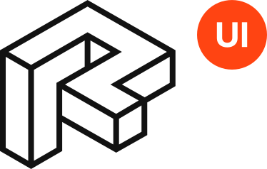

Revitron UI
===========

.. container:: .large

   Revitron UI is a `pyRevit <https://github.com/eirannejad/pyRevit>`_ extension written in Python 
   based on `Revitron <https://revitron.readthedocs.io/en/latest/>`_. 
   It helps you to work efficiently with complex models by automating common tasks. 

.. container:: .buttons

   `Get Started <get-started.html>`_

.. toctree::
   :caption: Revitron UI
   :maxdepth: 2
   :hidden:

   get-started
   tools
   
.. toctree::
   :caption: More
   :hidden:

   Revitron <https://revitron.readthedocs.io/en/latest/>
   RPM <https://github.com/revitron/rpm>
